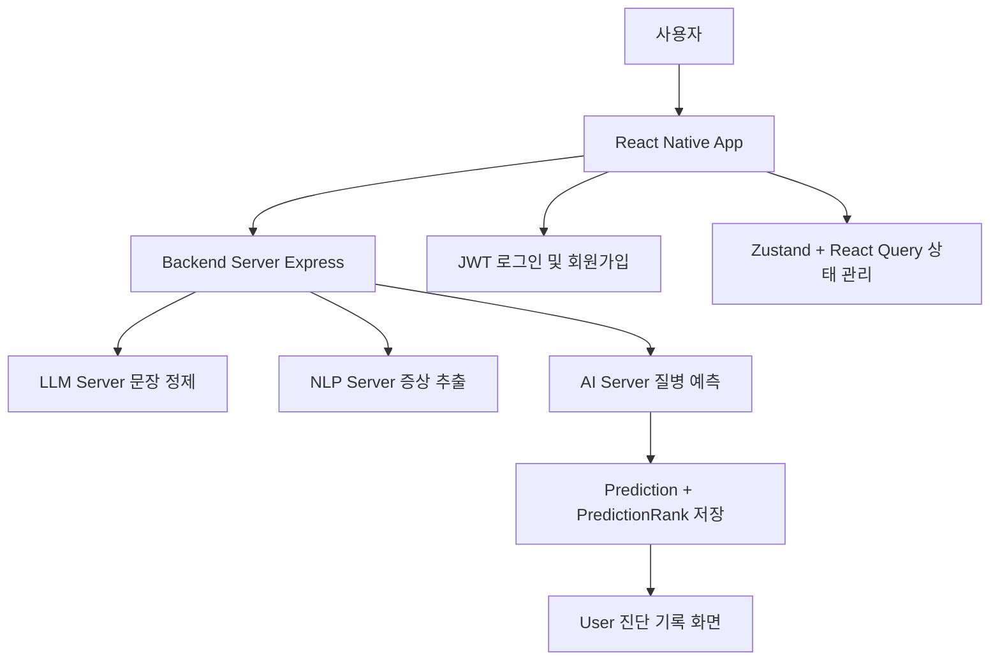

# 환경 구축 가이드

## expo 설정

- 서버와 모바일이 같은 공유기에 연결되어 있어야 함

```sh
# ipconfig - 무선 랜 ipv4 주소 확인
API_URL="http://<IP>:5000"
```

## 1. 의존성 설치 및 가상환경 생성

```sh
./setup.sh
```

## 2. 데이터베이스 설치 및 생성

- [postgreSQL 설치](https://www.postgresql.org/download/)
- `시작` - `SQL Shell (psql)` 실행

```sql
Server [localhost]:     -- (엔터 - 기본값)
Database [postgres]:    -- (엔터 - 기본값)
Port [5432]:            -- (엔터 - 기본값)
Username [postgres]:    -- (엔터 - 기본값)
postgres 사용자의 암호:   -- (설치 시 설정한 암호)

CREATE DATABASE ai_diagnosis; -- ai_diagnosis DB 생성
\l -- 현재 DB 목록 확인
\q -- 종료
```

## 3. .env 파일 작성
- `.env_example` 파일 이름 변경 -> `.env`
- `DATABASE_URL`변수의 `username`, `password` 변경 (SQL 실행 시 설정한 Username 및 사용자 암호)

## 4. 백엔드 - 데이터베이스 데이터 삽입

```sh
cd backend

npm run setup
```

## 5. 앱 실행(옵션 1, 2 중 택1)

**옵션 1. frontend, backend, ai, symptom을 별도의 터미널에서 실행**
```sh
# 각각 별도의 터미널에서 실행

# frontend
cd frontend
npm start

# backend
cd backend
npm start

# ai
cd ai
./start.sh

# extract
cd extract
./start.sh
```

**옵션 2. 모든 앱을 하나의 터미널에서 동시에 실행**
```sh
npm run dev
```

## (선택) API 리스트 새로 받기

- [식품의약품안전처 의약품 개요정보 서비스](https://www.data.go.kr/tcs/dss/selectApiDataDetailView.do?publicDataPk=15075057)
- [건강보험심사평가원 질병정보서비스](https://www.data.go.kr/tcs/dss/selectApiDataDetailView.do?publicDataPk=15119055)
- 공공데이터포털 API 사용 신청 후 `decoding 인증키`를 `.env`파일의 `MEDICATION_API_KEY`, `DISEASE_API_KEY`에 등록
- 스크립트 실행

```sh
cd backend

npx ts-node scripts/fetchAllMedications.ts
npx ts-node scripts/fetchAllDiseases.ts
```

## (선택) Ollama 기능 사용 시

- [ollama 다운로드](https://ollama.com/download)
- `mistral` 모델 설치 및 실행

```sh
ollama run mistral
```

---


# 프로젝트명: AI 진단 도우미 (AI 기반 자가 진단 서비스 - SmartHealth: AI Self-Diagnosis System)

AI 모델을 기반으로 사용자 증상을 입력 받아 질병을 예측하고, 건강 기록을 관리하는 자가진단 모바일 앱입니다.


# 1. 기술 스택 및 아키텍처 개요

## 1.1 기술 스택

| 구분         | 스택 |
|--------------|------|
| **프론트엔드** | React Native (Expo), TypeScript, NativeWind (Tailwind RN), React Query, Zustand |
| **백엔드**     | Node.js, Express.js, PostgreSQL, Prisma, Zod |
| **AI 서버**    | Python, FastAPI, BERT |
| **증상 추출**  | FastAPI, Googletrans, 증상 정규화 매핑 테이블, Mistral (Ollama) |
| **데이터베이스** | PostgreSQL |
| **인증/보안**  | JWT (Access Token 기반 인증) |

---

## 1.2 전체 아키텍처 흐름도



## 1.3 아키텍처 구성 설명

### React Native App
- Expo 기반 프론트엔드 앱
- 사용자 인터페이스(UI) 및 상호작용 처리
- 증상 입력, 예측 결과 확인, 진단 기록 조회 등 기능 수행
- 상태 관리는 `Zustand`, 서버 상태 관리는 `React Query` 사용

### Backend Server (Express)
- Node.js + Express.js 기반 API 서버
- 사용자 인증, 프로필 관리, 증상 기록, 예측 결과 저장 등 전반적인 API 처리
- Prisma를 통한 PostgreSQL ORM 연결
- LLM / NLP / AI 서버와의 중간 연동 허브 역할 수행
- 인증은 JWT 토큰 기반으로 처리

### LLM Server
- Python + FastAPI 기반 서버
- mistral 모델을 사용하여 입력 문장 정제 및 증상 추출

### NLP Server
- FastAPI 기반의 증상 추출 서버
- googletrans를 사용해 한글 → 영어 번역
- 한글 문장과 영어 문장 각각에서 증상 키워드 추출 후 한글 매핑 테이블 기반 병합 및 정규화 수행 후 증상 추출

### AI Server
- BERT 기반 하이브리드 모델 (MLP 결합) 사용
- coarse → fine 구조로 질병 예측
- 위험도 점수(riskScore), 예측 결과(coarseLabel, fineLabel), 가이드라인 제공

### PostgreSQL
- 사용자 정보, 예측 결과, 질병 및 약물 정보, 증상 기록 등을 저장
- Prisma를 통해 스키마 기반 데이터 모델링

### JWT 기반 인증
- 로그인/회원가입 시 JWT 발급
- 백엔드에서는 `auth.middleware.ts`로 토큰 검증
- 프론트에서는 `auth.store.ts`로 상태 관리

---

# 2. 백엔드 실행 스크립트 및 의존성 구성

## 2.1 실행 스크립트 (`scripts`)

| 명령어 | 설명 |
|--------|------|
| `npm run rm` | 기존 Prisma 마이그레이션 디렉토리 삭제 (`prisma/migrations` 폴더 제거) |
| `npm run reset` | 데이터베이스 초기화 후 마이그레이션 리셋 |
| `npm run migrate` | 현재 Prisma 스키마 기준 마이그레이션 수행 |
| `npm run generate` | Prisma 클라이언트 코드 생성 |
| `npm run seed` | `prisma/seed.ts` 파일 실행 (지병/약물 등 초기 데이터 삽입) |
| `npm run studio` | Prisma Studio 실행 (웹 기반 DB UI) |
| `npm run insert` | `scripts/insert*.ts` 스크립트 3종 실행 (질병, 약물, 증상 데이터 삽입) |
| `npm run setup` | 위의 rm → reset → migrate → generate → insert → seed 순으로 전체 초기 세팅 자동화 |
| `npm run start` | TypeScript 워치(`tsc -w`) + 빌드된 서버 파일(`dist/server.js`)을 nodemon으로 실행 |

---

## 2.2 주요 의존성 (`dependencies`)

| 패키지 | 설명 |
|--------|------|
| `express` | Node.js 기반 REST API 서버 프레임워크 |
| `prisma`, `@prisma/client` | ORM 도구 및 런타임 클라이언트 |
| `pg` | PostgreSQL 데이터베이스 드라이버 |
| `zod` | 입력값 유효성 검증 스키마 정의 |
| `jsonwebtoken`, `bcrypt` | JWT 인증 처리, 비밀번호 해싱 |
| `cors`, `body-parser`, `dotenv` | API 통신 설정 및 환경 변수 관리 |
| `uuid` | UUID 생성 (예: 고유 ID 할당용) |
| `axios` | 외부 API 요청 처리용 HTTP 클라이언트 |
| `xml2js` | XML 데이터를 JSON으로 파싱 (공공 API 처리용) |

---

## 2.3 개발용 의존성 (`devDependencies`)

| 패키지 | 설명 |
|--------|------|
| `typescript`, `ts-node` | TypeScript 실행 및 컴파일 도구 |
| `nodemon`, `concurrently` | 개발 서버 자동 재시작 및 병렬 실행 |
| `dotenv-cli` | `.env` 파일 로딩 및 명령어 연동 |
| `@types/*` | TypeScript용 타입 정의 패키지들 (express, node 등) |

---

## 2.4 빌드 및 실행 방식

- TypeScript 기반 개발이므로, `tsc -w`로 실시간 빌드하고, `nodemon`이 `dist/server.js` 실행
- 환경 변수는 `.env`를 최상위 경로(`../.env`)에서 로드하며, 모든 CLI 명령에 `dotenv -e`로 적용
- Prisma ORM은 `schema.prisma` 기반으로 DB와 동기화 및 클라이언트 생성

---

# 3. 프론트엔드 실행 스크립트 및 의존성 구성

## 3.1 실행 스크립트 (`scripts`)

| 명령어 | 설명 |
|--------|------|
| `npm run start` | Expo 개발 서버 실행 (기본 웹 대시보드 제공) |
| `npm run android` | 안드로이드 에뮬레이터 또는 연결된 디바이스에서 실행 |
| `npm run ios` | iOS 시뮬레이터 또는 기기에서 실행 (macOS에서만 가능) |
| `npm run web` | 웹 브라우저 환경에서 실행 (React Native Web 기반) |

---

## 3.2 주요 의존성 (`dependencies`)

| 패키지 | 설명 |
|--------|------|
| `expo` | React Native 앱을 빠르게 개발할 수 있도록 도와주는 프레임워크 |
| `expo-router` | 파일 기반 라우팅 제공, Next.js 스타일의 페이지 관리 |
| `react`, `react-native` | React Native의 핵심 라이브러리 |
| `@tanstack/react-query` | 서버 상태 관리, API 캐싱 및 로딩 처리 |
| `axios` | HTTP 요청을 위한 클라이언트 |
| `zustand` | 글로벌 상태 관리 라이브러리 (경량 Redux 대체) |
| `zod` | 입력값 유효성 검증을 위한 스키마 라이브러리 |
| `@react-native-async-storage/async-storage` | 로컬 스토리지 저장소 |
| `expo-status-bar`, `expo-splash-screen`, `expo-constants` | 상태바, 스플래시 및 앱 메타 정보 관리 |
| `react-native-safe-area-context`, `react-native-screens`, `react-native-gesture-handler` | 네이티브 UI/UX 개선을 위한 필수 유틸 라이브러리 |
| `react-native-web`, `react-dom` | Expo 앱의 웹 호환을 위한 필수 패키지들 |

---

## 3.3 개발용 의존성 (`devDependencies`)

| 패키지 | 설명 |
|--------|------|
| `typescript` | 타입스크립트 언어 지원 |
| `@babel/core` | Expo 및 React Native 환경에서의 Babel 트랜스파일러 |
| `@types/react` | 타입스크립트용 React 타입 선언 파일 |

---

## 3.4 실행 방식 및 구조 설명

- 프로젝트는 Expo Router를 기반으로 파일 구조에 따라 자동 라우팅 처리
- 앱의 진입점은 `expo-router/entry`이며, `app/` 폴더 내부 구조에 따라 화면을 자동 구성
- `zustand`는 사용자 인증 정보 등 앱 전역 상태 관리에 사용
- `react-query`는 서버 API와의 통신에서 비동기 상태 관리와 캐싱을 제공
- 모든 데이터 유효성 검사는 `zod`를 사용하여 프론트와 백엔드 모두 동일한 스키마를 기반으로 처리

---

